# Computational Creativity – Project Companion

Welcome to the companion site for my ECS7022P Computational Creativity assignment. This project investigates how generative AI can support **co-creative music workflows**, especially in sample-based music and DJing contexts.

Rather than generating full tracks, this system empowers artists with controllable, iterative generation of **audio samples** via **text prompts**, **inversion**, and **direct latent manipulation**.

---

## 🎨 Conditional Text-to-Audio Generation

Explore controllable music generation from text prompts.

### 🔹 Example 1
**Prompt:** _"ambient, piano, love"_

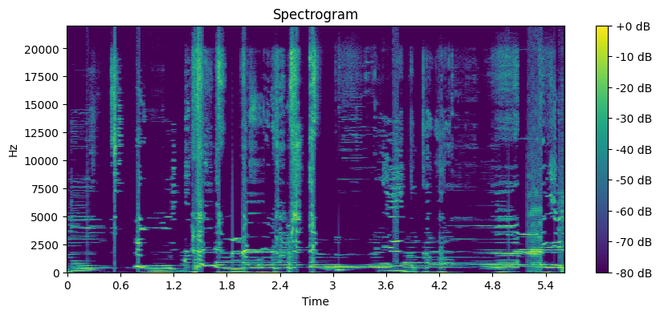
<audio controls>
  <source src="content/samples/cond1.wav" type="audio/wav">
</audio>

### 🔹 Example 2
**Prompt:** _"glitchy, industrial, techno"_

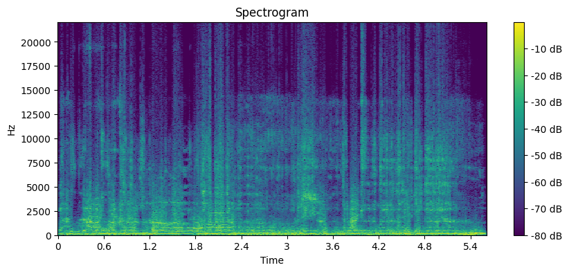
<audio controls>
  <source src="content/samples/cond2.wav" type="audio/wav">
</audio>

### 🔹 Example 3
**Prompt:** _"funk, bass, upbeat"_

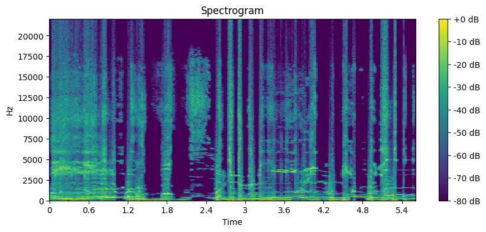
<audio controls>
  <source src="content/samples/cond3.wav" type="audio/wav">
</audio>

---

## 🔁 DDIM Inversion – Prompt-Based Editing

Transform a generated audio sample by modifying its prompt. Each row below shows:

- Original prompt → New prompt
- Spectrogram of edited output
- Audio of edited output

### 🔹 Example 1
**Original Prompt:** _"lofi, guitar, mellow"_ → **Edited Prompt:** _"lofi, guitar, distorted"_

<audio controls>
  <source src="content/samples/invert1.wav" type="audio/wav">
</audio>

### 🔹 Example 2
**Original Prompt:** _"jazz, saxophone"_ → **Edited Prompt:** _"jazz, saxophone, ambient"_

<audio controls>
  <source src="content/samples/invert2.wav" type="audio/wav">
</audio>

### 🔹 Example 3
**Original Prompt:** _"drum and bass, club, energetic"_ → **Edited Prompt:** _"breakcore, distorted, chaos"_

<audio controls>
  <source src="content/samples/invert3.wav" type="audio/wav">
</audio>

---

## 🧠 Inversion Variants – Audio-Guided and Negative Prompt Edits

### 🎙 Audio-to-Audio Guidance
Use one audio sample to guide another using DDIM inversion.

### 🔹 Example 1
_Source → Target audio guidance (semantic morphing)_

<audio controls>
  <source src="content/samples/audio_guided1.wav" type="audio/wav">
</audio>

### 🔹 Example 2

<audio controls>
  <source src="content/samples/audio_guided2.wav" type="audio/wav">
</audio>

### 🔹 Example 3

<audio controls>
  <source src="content/samples/audio_guided3.wav" type="audio/wav">
</audio>

### 🚫 Negative Prompt Inversion
Guide the model **away** from a concept (e.g. "remove vocals").

### 🔹 Example 1
**Prompt:** _"jazz, vocals"_ → **Negative Prompt:** _"vocals"_

<audio controls>
  <source src="content/samples/neg1.wav" type="audio/wav">
</audio>

### 🔹 Example 2
**Prompt:** _"orchestral, cinematic"_ → **Negative Prompt:** _"cinematic"_

<audio controls>
  <source src="content/samples/neg2.wav" type="audio/wav">
</audio>

### 🔹 Example 3
**Prompt:** _"vocal chop, club"_ → **Negative Prompt:** _"vocal"_

<audio controls>
  <source src="content/samples/neg3.wav" type="audio/wav">
</audio>

---

## 🎛 Deterministic Latent Manipulations

Latent-level transformations that are fast, repeatable, and interpretable.

### ✨ Vector-Style Latent Operations
Examples: Interpolation, blending, mirroring
### 🔹 Example 1 – Interpolation between A and B
**Source A (Dynasties and Dystopia):**  
<audio controls>
  <source src="content/samples/A_dynasties_and_dystopia.wav" type="audio/wav">
</audio>

**Source B (Pump It):**  
<audio controls>
  <source src="content/samples/B_pump_it.wav" type="audio/wav">
</audio>

**Interpolation Result:**  
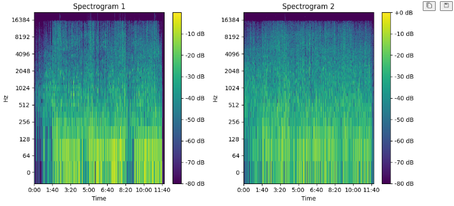
<audio controls>
  <source src="content/samples/latent_vec1.wav" type="audio/wav">
</audio>

### 🔹 Example 2 – Swirl Mix

<audio controls>
  <source src="content/samples/swirl.wav" type="audio/wav">
</audio>

### 🔹 Example 3 – Smooth
**Source A (Dynasties and Dystopia) - gaussian kernel std: 3.0:**  
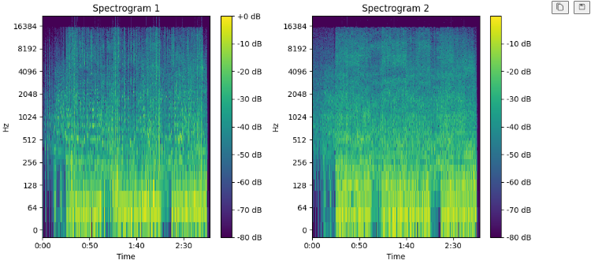
<audio controls>
  <source src="content/samples/SmoothA.wav" type="audio/wav">
</audio>

**Source B (Pump It):  - gaussian kernel std: 2.0:**  

<audio controls>
  <source src="content/samples/SmoothB.wav" type="audio/wav">
</audio>

### 🖼 Image-Style Latent Edits
Examples: Contrast, Jitter, Bloat, Warp

**Source A (Dynasties and Dystopia)**  
<audio controls>
  <source src="docs/content/samples/A_dynasties_and_dystopia.wav" type="audio/wav">
</audio>

### 🔹 Example 1 – Emboss

#### example of image embossing

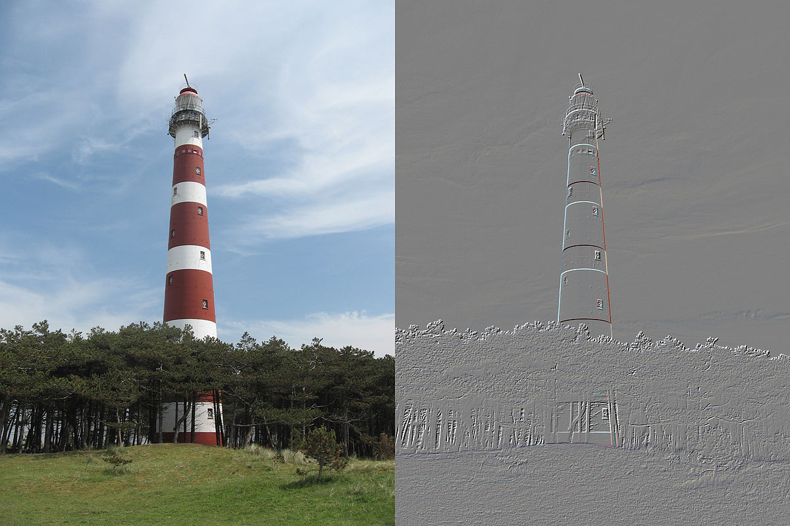

#### applied to Music2Latent

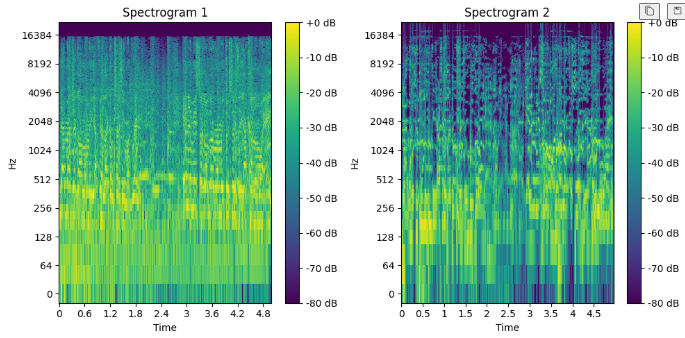
<audio controls>
  <source src="content/samples/emboss_A.wav" type="audio/wav">
</audio>

### 🔹 Example 2 – Jitter

#### example of image color jitter

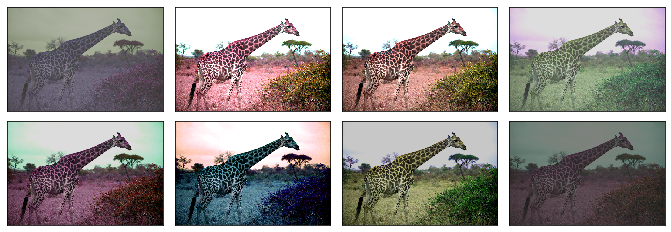

#### applied to Music2Latent

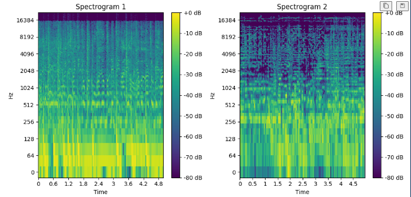
<audio controls>
  <source src="content/samples/Jitter.wav" type="audio/wav">
</audio>

### 🔹 Example 3 – Solarize

#### example of image Solarization

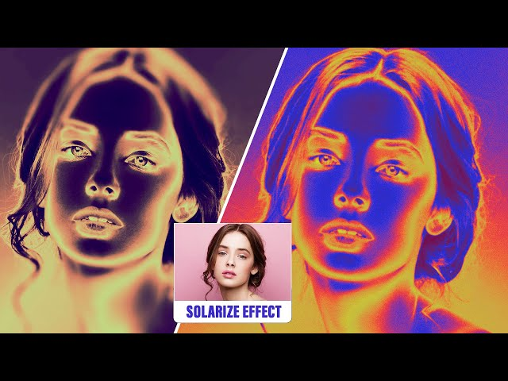

#### applied to Music2Latent

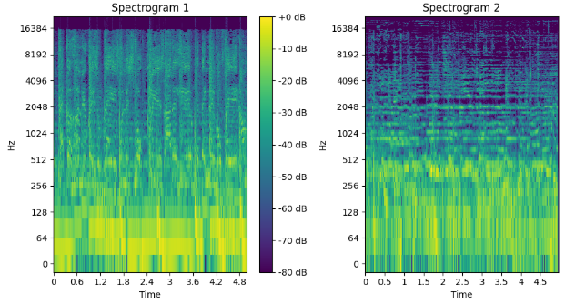
<audio controls>
  <source src="content/samples/Solarize.wav" type="audio/wav">
</audio>

### 🔹 Example 3 – Invert

#### example of image Inversion

#### applied to Music2Latent

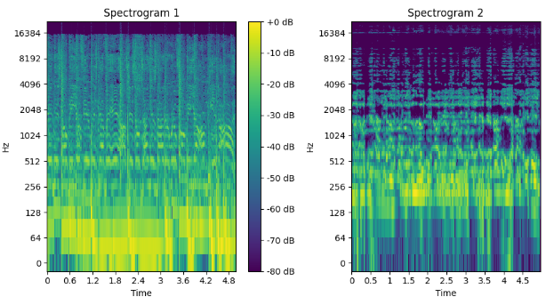
<audio controls>
  <source src="content/samples/Invert.wav" type="audio/wav">
</audio>

---

## 📎 Resources

- [GitHub Repository](https://github.com/Pliploop/CompCreative)
- [Colab Notebook](https://colab.research.google.com/drive/1aqACUO1xs5GzviQyLbem_MmnLE9V8Xwy?usp=sharing)
- [PDF Report](content/report.pdf)

_This site was generated using Jekyll and hosted with GitHub Pages._